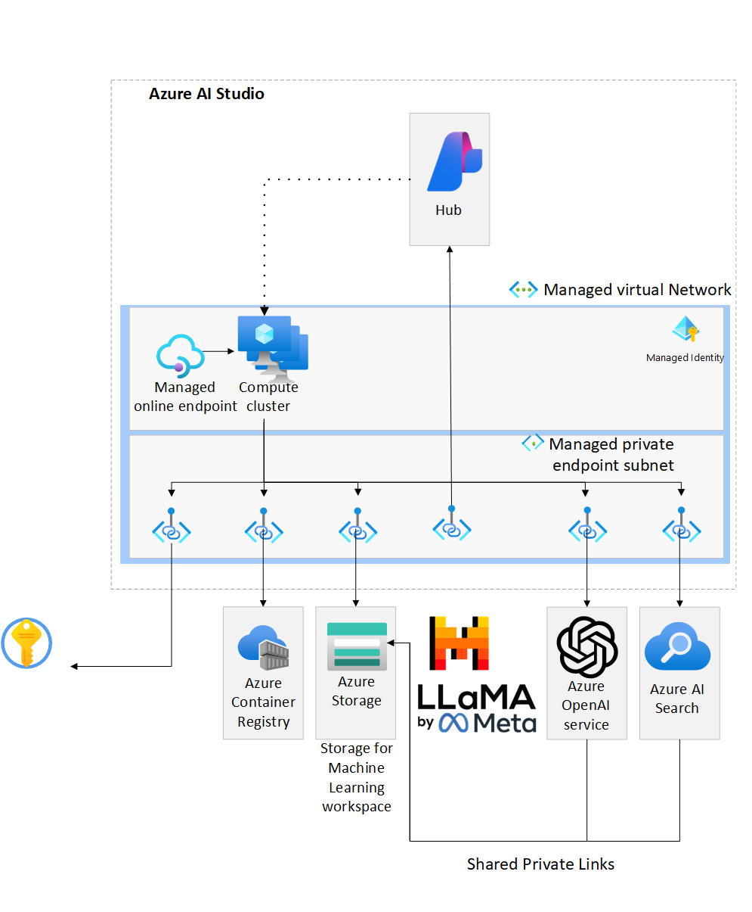
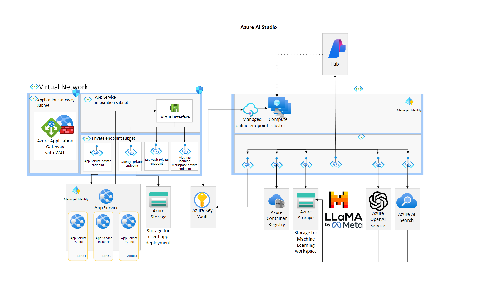
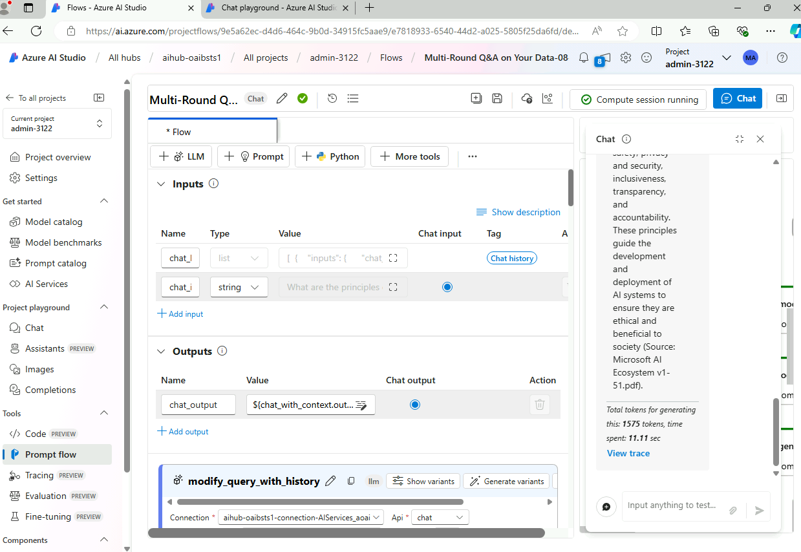

# AI Studio end-to-end baseline reference implementation

This reference implementation based on our [Baseline OpenAI end-to-end chat reference architecture](https://learn.microsoft.com/en-us/azure/architecture/ai-ml/architecture/baseline-openai-e2e-chat) demonstrates how to author and run various AI-driven applications, including chat applications, using Azure AI Studio and OpenAI within a single region. It offers a secure and private environment suitable for enterprises, with options for deploying the application:

- An Azure AI Studio-managed online endpoint in a managed virtual network.
  - For applications demanding high availability, deploying multiple online endpoints behind a load balancer to enhance resiliency is advisable.
- A network-isolated, zone-redundant, highly available deployment using Azure App Service.

Leveraging the scalable features of [Promptflow](https://microsoft.github.io/promptflow/) within [Azure AI Studio](https://azure.microsoft.com/services/ai-studio/), the architecture supports the creation and deployment of robust AI workflows, including:

- Prompt composition
- Data querying for contextual grounding
- Custom Python scripts
- Large Language Models (LLMs) integration

The implementation seeks to meet enterprise requirements concerning:

- Secure Network Perimeter
- Identity Management
- Scalability

## Reference Architecture



The implementation covers the following scenarios:

1. Testing/Authoring using AI Studio Chat Playground
2. Authoring a flow - Authoring a flow using prompt flow in an Azure AI Studio
3. Deploying a flow to Azure AI Studio (AML hosted option) - The deployment of an executable flow to an Azure AI Studio online endpoint. The client UI that is hosted in Azure App Service accesses the deployed flow.
4. Deploying a flow to Azure App Service (Self-hosted option) - The deployment of an executable flow as a container to Azure App Service. The client UI that accesses the flow is also hosted in Azure App Service.

## Deployment

The following are prerequisites.

### Prerequisites

- Ensure you have an [Azure Account](https://azure.microsoft.com/free/)
- The deployment must be started by a user who has sufficient permissions to assign [roles](https://learn.microsoft.com/azure/role-based-access-control/built-in-roles), such as a User Access Administrator or Owner.
- Ensure you have the [Azure CLI installed](https://learn.microsoft.com/cli/azure/install-azure-cli)
- Ensure you have the [az Bicep tools installed](https://learn.microsoft.com/azure/azure-resource-manager/bicep/install)

### Deploy the infrastructure

The following steps are required to deploy the infrastructure from the command line.

1. In your bash shell (or VSCode session) with Azure CLI and Bicep installed, navigate to the root directory of this repository (AppServicesRI).

2. Login and set subscription

```bash
az login
az account set --subscription xxxxx
```

3. Obtain the App Gateway certificate using the `GenerateCertificate.ps1` script (or manually as described below).

#### PowerShell Script:

Run `GenerateCertificate.ps1` to create a self-signed certificate:

```powershell
# Set the domain name
$DomainName = "contoso.com"
$certName = "appgw"

# Generate a self-signed certificate
$cert = New-SelfSignedCertificate -DnsName $DomainName -CertStoreLocation "Cert:\CurrentUser\My" -NotAfter (Get-Date).AddYears(1)

# Path where the PFX file will be exported
$filePath = ".\$certName.pfx"

# Export the certificate to a PFX file with the password
$password = New-Object System.Security.SecureString
Export-PfxCertificate -Cert $cert -FilePath $filePath -Password $password

# Base64 encode the certificate
$CertContent = Get-Content -Path $filePath -AsByteStream
$CertBase64 = [Convert]::ToBase64String($CertContent)

Write-Host "APP_GATEWAY_LISTENER_CERTIFICATE_APPSERV_BASELINE: $CertBase64"
```

#### Manual Steps:

- Set a variable for the domain used in the rest of this deployment.

```bash
export DOMAIN_NAME_APPSERV_BASELINE="contoso.com"
```

- Generate a client-facing, self-signed TLS certificate.

:warning: Do not use the certificate created by this script for actual deployments.

```bash
openssl req -x509 -nodes -days 365 -newkey rsa:2048 -out appgw.crt -keyout appgw.key -subj "/CN=${DOMAIN_NAME_APPSERV_BASELINE}/O=Contoso" -addext "subjectAltName = DNS:${DOMAIN_NAME_APPSERV_BASELINE}" -addext "keyUsage = digitalSignature" -addext "extendedKeyUsage = serverAuth"
openssl pkcs12 -export -out appgw.pfx -in appgw.crt -inkey appgw.key -passout pass:
```

- Base64 encode the client-facing certificate.

```bash
export APP_GATEWAY_LISTENER_CERTIFICATE_APPSERV_BASELINE=$(cat appgw.pfx | base64 | tr -d '\n')
echo APP_GATEWAY_LISTENER_CERTIFICATE_APPSERV_BASELINE: $APP_GATEWAY_LISTENER_CERTIFICATE_APPSERV_BASELINE
```

4. Update the infra-as-code/parameters file using the `GetUserObjectId.ps1` script for obtaining user object ID.

#### PowerShell Script:

Run `GetUserObjectId.ps1`:

```powershell
# Connect to Azure with your account
Connect-AzAccount

# Get the current user's Object ID
$currentUser = Get-AzADUser -UserPrincipalName (Get-AzContext).Account.Id
Write-Host "Your Azure user object ID is: $currentUser.Id"
```

Fill in the `infra-as-code/parameters.json` file:

```json
{
  "$schema": "https://schema.management.azure.com/schemas/2019-04-01/deploymentParameters.json#",
  "contentVersion": "1.0.0.0",
  "parameters": {
    "baseName": {
      "value": ""
    },
    "developmentEnvironment": {
      "value": true
    },
    "appGatewayListenerCertificate": {
      "value": "[base64 cert data from $APP_GATEWAY_LISTENER_CERTIFICATE_APPSERV_BASELINE]"
    },
    "userObjectId": {
      "value": "[your userObjectId here]"
    },
    "deploySharedPrivateLink": {
      "value": true
    }
  }
}
```

5. Run the following command to create a resource group and deploy the infrastructure. You can execute manually or use the `DeployResources.ps1` script.

- The location you choose [supports availability zones](https://learn.microsoft.com/azure/reliability/availability-zones-service-support).
- The BASE_NAME contains only lowercase letters and is between 6 and 8 characters. Most resource names will include this text.
- You choose a valid resource group name.
- You will be prompted for an admin password for the jump box; it must satisfy the [complexity requirements for Windows](https://learn.microsoft.com/en-us/windows/security/threat-protection/security-policy-settings/password-must-meet-complexity-requirements).

```bash
LOCATION=eastus
BASE_NAME=<base-resource-name (between 6 and 8 lowercase characters)>

RESOURCE_GROUP=<resource-group-name>
az group create -l $LOCATION -n $RESOURCE_GROUP

# This takes about 30 minutes to run.
az deployment group create -f ./infra-as-code/bicep/main.bicep \
  -g $RESOURCE_GROUP \
  -p @./infra-as-code/bicep/parameters.json \
  -p baseName=$BASE_NAME
```

Alternatively, automate with `DeployResources.ps1`:

```powershell
function Deploy-AzureResources {
    param (
        [string]$baseName,
        [string]$resourceGroupName,
        [string]$location
    )

    az group create -l $location -n $resourceGroupName

    az deployment group create -f ../infra-as-code/bicep/main.bicep `
      -g $resourceGroupName `
      -p "@../infra-as-code/bicep/parameters.json" `
      -p baseName=$baseName
}

# Example invocation
Deploy-AzureResources -baseName "mybase1" -resourceGroupName "MyResourceGroup2" -location "francecentral"
```

Make sure that after deployment you go to your AI Search resource and approve the Private Shared links. This has to be done manually for each one.


## Project Playground

AI Studio Project Playground serves as a streamlined arena where users can interact with different AI technologies. The platform offers a Chat Playground where you can test conversational features of Azure OpenAI and chat with your own data. In addition, the Assistants section allows using file search, code interpreter for sandboxed code generation and execution, and functions. The platform also includes a feature for creating Images, as well as a section devoted to generating Completions, helping to round out creative or complex texts. Overall, this playground is a one-stop shop for crafting, assessing, and perfecting your AI-driven projects.

### Chat with your Data


> [!IMPORTANT]  
> Since this feature is in preview it might not work as expected

Once your data is indexed, you can readily test its integration with LLMs through the AI Studio Playground. This interactive space provides a user-friendly interface to run queries against your data, observe how the LLM utilizes the indexed information, and refine the interaction experience. Here's how you can leverage the AI Studio Playground with your indexed datasets:

To provide AI models with direct access to relevant data, Azure AI Studio allows you to index your own datasets. This will enable more sophisticated queries and generate richer, context-aware interactions. Follow the steps below to index your data within Azure AI Studio and put it to work using the AI models and Playground.

#### Step-by-Step Process

1. **Temporary Workaround**: Go to the storage account that contains the letters "ml" in the deployment resource group, go to networking, and manually change from "Selected Virtual Networks" to "Disabled".

2. **Deploy AI Models and Embeddings**: Before proceeding, ensure that your AI models and embeddings are deployed and operational within your Azure AI services. These models are essential as they process and derive meaning from your indexed data.

3. **Connect to AI Studio Hub**: Access your Azure AI Studio Hub and establish a connection. This is your gateway to leveraging the capabilities provided by Azure AI Studio.

4. **Create a new AI Search Connection**: Create a new connection using EntraID in the section Connections and select AI Search.

5. **Create a New Project**: Within the AI Studio Hub, initiate a new project which will serve as the container for your AI applications and data.

6. **Add Data through the Chat Section**: Navigate to the 'Chat' section of your project, and click on the tab 'Add Your Data (Preview)'. You can now choose to upload a new file or select an existing file from Azure AI Studio to include in your data index. We recommend that you add data to your storage account separately by using the Azure Portal, going into your storage account, creating a new container, and then uploading the data there.

7. **Create a New Index**: After selecting or uploading your data, move forward by creating a new index. You'll be required to manually input essential information such as the Endpoint and API Key to proceed. This allows Azure AI Studio to interact with your data storage and indexing services.

8. **Index Creation Jobs**: Upon configuring your index, Azure AI Studio will initiate Azure Machine Learning workspace jobs to process and build the index. This step may take a while, depending on the size and complexity of your data.

9. **Test and Query in the Playground**: With the index created, return to the AI Studio Playground. Here, you can start running queries, asking questions, and observing how your AI models utilize the newly indexed data to provide responses.

By indexing your own data, you turn the Playground into a powerful tool not just for testing generic AI capabilities but for validating and improving your specific AI-driven applications. The integrated environment of Azure AI Studio simplifies this process, allowing you to focus on crafting the most engaging and intelligent experiences based on your unique datasets.

## Assistants


Azure OpenAI Assistants (Preview) allows you to create AI assistants tailored to your needs through custom instructions and augmented by advanced tools like code interpreter, and custom functions.

You can test this feature by clicking assistants where you can use the tools provided such as File Search, Code Interpreter, and Custom Functions.

## Promptflow

### Authoring a flow

The authoring architecture diagram illustrates how flow authors [connect to an Azure AI Studio through a private endpoint](https://learn.microsoft.com/en-us/azure/ai-studio/how-to/configure-private-link?tabs=azure-portal) in a virtual network. In this case, the author connects to the virtual network through Azure Bastion and a virtual machine jumpbox. Connectivity to the virtual network is more commonly done in enterprises through ExpressRoute or virtual network peering.

The diagram further illustrates how Azure AI Studio is configured for [Managed virtual network isolation](https://learn.microsoft.com/en-us/azure/ai-studio/how-to/configure-managed-network). With this configuration, a managed virtual network is created, along with managed private endpoints enabling connectivity to private resources such as the workplace Azure Storage and Azure Container Registry. You can also create user-defined connections like private endpoints to connect to resources like Azure OpenAI Service and Azure AI Search (previously named Cognitive Search). Differently from Azure Machine Learning, AI Studio doesn't support bringing your own vnet.

### Deploying a flow to Azure AI Studio managed online endpoint



The Azure AI Studio deployment architecture diagram illustrates how a front-end web application, deployed into a [network-secured App Service](https://github.com/Azure-Samples/app-service-baseline-implementation), [connects to a managed online endpoint through a private endpoint](https://learn.microsoft.com/en-us/azure/ai-studio/how-to/configure-private-link?tabs=azure-portal) in a virtual network. Like the authoring flow, the diagram illustrates how the Azure AI Studio is configured for [Workspace managed virtual network isolation](https://learn.microsoft.com/en-us/azure/ai-studio/how-to/configure-managed-network). The deployed flow is able to connect to required resources such as Azure OpenAI and AI Search through managed private endpoints.

### Deploying a flow to Azure App Service (alternative)


The Azure App Service deployment architecture diagram illustrates how the same prompt flow can be containerized and deployed to Azure App Service alongside the same front-end web application from the prior architecture. This solution is a completely self-hosted, externalized alternative to an Azure AI Studio managed online endpoint.

The flow is still authored in a network-isolated Azure AI Studio. To deploy in App Service in this architecture, the flows need to be containerized and pushed to the Azure Container Registry that is accessible through private endpoints to the App Service.

### Create, test, and deploy a Prompt flow



1. Connect to the virtual network via Azure Bastion and the jump box (deployed as part of this solution) or through a force-tunneled VPN or virtual network peering that you manually configure.

2. Open the [Azure AI Studio](https://ml.azure.com/) and choose your workspace. Ensure you have [enabled Prompt flow in your Azure AI Studio](https://learn.microsoft.com/azure/machine-learning/prompt-flow/get-started-prompt-flow?view=azureml-api-2#prerequisites-enable-prompt-flow-in-your-azure-machine-learning-workspace).

3. Create a prompt flow connection to your Azure OpenAI deployment. This will be used by the prompt flow you clone in the next step.
    - Click on 'Prompt flow' in the left navigation in Machine Learning Studio
    - Click on the 'Connections' tab and click 'Create' 'Azure OpenAI.'
    - Fill out the properties:
        - Name: 'your deployment'   
        - Provider: Azure AI Services (OpenAI)
        - Subscription Id: <Choose your subscription>
        - Azure OpenAI Account Names: <Choose the Azure OpenAI Account created in this deployment>
        - API Key: <Choose a key from 'Keys and endpoint' in your Azure OpenAI instance in the Portal>
        - API Base: <Choose the endpoint from 'Keys and endpoint' in your Azure OpenAI instance in the Portal>
        - API type: azure
        - API version: <Leave default>

4. Clone an existing prompt flow
    - Click on 'Prompt flow' in the left navigation in Machine Learning Studio
    - Click on the 'Flows' tab and click 'Create'
    - Click 'Clone' under 'Chat with Wikipedia'
    - Name it 'chat_wiki' and Press 'Clone'
    - Set the 'Connection' and 'deployment_name' to 'gpt4' and set the max_tokens property of the deployment_name to 256, for the following steps:
        - extract_query_from_question
        - augmented_chat
    - Save

5. Add runtime

   - Click Add runtime
   - Add compute instance runtime and give it a name
   - Choose the compute instance created by the Bicep  
   - Accept the other defaults and click 'Create'

6. Test the flow

   - Wait for the runtime to be created
   - Select the runtime in the UI
   - Click on 'Chat' on the UI
   - Enter a question
   - The response should echo your question with 'Echo' appended

### Deploy to Azure AI Studio managed online endpoint

1. Create a deployment in the UI

   - Click on 'Deploy' in the UI
   - Choose 'Existing' Endpoint and select the one called _ept-<basename>_
   - Name the deployment ept-<basename>. **Make sure you name the deployment ept-<basename>. An App Service environment variable is set, assuming that naming convention**
   - Choose a small Virtual Machine size for testing and set the number of instances.
   - Press 'Review + Create'
   - Press 'Create'

### Publish the Chat front-end web app

The baseline architecture uses [run from zip file in App Service](https://learn.microsoft.com/azure/app-service/deploy-run-package). This approach has many benefits, including eliminating file lock conflicts when deploying.

> :bulb: Read through the next steps, but follow the guidance in the **Workaround** section.

To use run from zip, you do the following:

1. Create a [project zip package](https://learn.microsoft.com/azure/app-service/deploy-run-package#create-a-project-zip-package) which is a zip file of your project.
2. Upload that zip file to a location accessible to your website. This implementation uses private endpoints to connect to the storage account securely. The web app has a managed identity authorized to access the blob.
3. Set the environment variable `WEBSITE_RUN_FROM_PACKAGE` to the URL of the zip file.

In a production environment, you would likely use a CI/CD pipeline to:

1. Build your application
2. Create the project zip package
3. Upload the zip file to your storage account

The CI/CD pipeline would likely use a [self-hosted agent](https://learn.microsoft.com/azure/devops/pipelines/agents/agents?view=azure-devops&tabs=browser#install) that can connect to the storage account through a private endpoint to upload the zip. We have not implemented that here.

**Workaround**

We need a workaround to upload the file to the storage account because we have not implemented a CI/CD pipeline with a self-hosted agent. There are two workaround steps you need to do in order to manually upload the zip file using the portal.

1. The deployed storage account does not allow public access, so you will need to temporarily allow access from your IP address.
2. You must authorize your user to upload a blob to the storage account.

Run the following to:

- Allow access from your IP address.
- Give the logged-in user permission to upload a blob.
- Upload the zip file `./website/chatui.zip` to the existing `deploy` container.
- Tell the web app to restart.

```bash
CLIENT_IP_ADDRESS=<your-public-ip-address>

STORAGE_ACCOUNT_PREFIX=st
WEB_APP_PREFIX=app-
NAME_OF_STORAGE_ACCOUNT="$STORAGE_ACCOUNT_PREFIX$BASE_NAME"
NAME_OF_WEB_APP="$WEB_APP_PREFIX$BASE_NAME"
LOGGED_IN_USER_ID=$(az ad signed-in-user show --query id -o tsv)
RESOURCE_GROUP_ID=$(az group show --resource-group $RESOURCE_GROUP --query id -o tsv)
STORAGE_BLOB_DATA_CONTRIBUTOR=ba92f5b4-2d11-453d-a403-e96b0029c9fe

az storage account network-rule add -g $RESOURCE_GROUP --account-name "$NAME_OF_STORAGE_ACCOUNT" --ip-address $CLIENT_IP_ADDRESS
az role assignment create --assignee-principal-type User --assignee-object-id $LOGGED_IN_USER_ID --role $STORAGE_BLOB_DATA_CONTRIBUTOR --scope $RESOURCE_GROUP_ID

az storage blob upload -f ./website/chatui.zip \
  --account-name $NAME_OF_STORAGE_ACCOUNT \
  --auth-mode login \
  -c deploy -n chatui.zip

az webapp restart --name $NAME_OF_WEB_APP --resource-group $RESOURCE_GROUP
```

### Validate the web app

This section will help you validate that the workload is exposed correctly and responding to HTTP requests.

#### Steps

1. Get the public IP address of the Application Gateway.

   > :book: The app team conducts a final acceptance test to be sure that traffic is flowing end-to-end as expected, so they place a request against the Azure Application Gateway endpoint.

   ```bash
   # query the Azure Application Gateway Public Ip
   APPGW_PUBLIC_IP=$(az network public-ip show --resource-group $RESOURCE_GROUP --name "pip-$BASE_NAME" --query [ipAddress] --output tsv)
   echo APPGW_PUBLIC_IP: $APPGW_PUBLIC_IP
   ```

2. Create an `A` record for DNS.

   > :bulb: You can simulate this via a local hosts file modification. Alternatively, you can add a real DNS entry for your specific deployment's application domain name if permission to do so.

   Map the Azure Application Gateway public IP address to the application domain name. To do that, please edit your hosts file (`C:\Windows\System32\drivers\etc\hosts` or `/etc/hosts`) and add the following record to the end: `${APPGW_PUBLIC_IP} www.${DOMAIN_NAME_APPSERV_BASELINE}` (e.g. `50.140.130.120 www.contoso.com`)

3. Browse to the site (e.g. <https://www.contoso.com>).

   > :bulb: It may take up to a few minutes for the App Service to start properly. Remember to include the protocol prefix `https://` in the URL you type in your browser's address bar. A TLS warning will be present due to using a self-signed certificate. You can ignore it or import the self-signed cert (`appgw.pfx`) to your user's trusted root store.

## Deploying the flow to Azure App Service option

This is a second option for deploying the flow. With this option, you deploy the flow to Azure App Service instead of the managed online endpoint. At a high level, you must do the following:

- Prerequisites - Ensure you have the prerequisites
- Download your flow - Download the flow from the Azure AI Studio
- Build the flow - Use the `pf` CLI to build your flow
- Build and push the image - Containerize the flow and push to your Azure Container Registry
- Publish the image to Azure App Service

### Prerequisites

The following are requirements for building the image, pushing to ACR, and deploying to Azure App Service:

- az CLI
- Python
- Anaconda
- Promptflow pf CLI

Below are commands to create and activate a conda environment and install the promptflow tools. See [Set up your dev environment](https://microsoft.github.io/promptflow/how-to-guides/quick-start.html#set-up-your-dev-environment) for more information.

```bash
conda create --name pf python=3.11.4
conda activate pf
pip install promptflow promptflow-tools

# You will need to install the following if you build the docker image locally
pip install keyrings.alt
pip install bs4
```

### Download your flow

1. Open the Prompt flow UI in Azure AI Studio Studio
2. Expand the 'Files' tab in the right pane of the UI
3. Click on the download icon to download the flow as a zip file

> :bulb: If you are using a jumpbox to connect to Azure AI Studio, when you download the flow, it will be downloaded to your jumpbox. You will either need to have the prerequisites installed on the jumpbox, or you will need to transfer the zip file to a system that has the prerequisites.

### Build the flow

> :bulb: This example assumes your flow has a connection to Azure OpenAI

1. Unzip the prompt flow zip file you downloaded.
2. In your terminal, change the directory to the root of the unzipped flow.
3. Create a folder called 'connections'.
4. Create a file for each connection you created in the Prompt flow UI.
    - Make sure you name the file to match the name you gave the connection. For example, if you named your connection 'gpt4' in Prompt flow, create a file called 'gpt4.yaml' under the connections folder.
    - Enter the following values in the file:

```yaml
$schema: https://azuremlschemas.azureedge.net/promptflow/latest/AzureOpenAIConnection.schema.json
name: gpt4
type: azure_open_ai
api_key: "${env:OPENAICONNECTION_API_KEY}"
api_base: "${env:OPENAICONNECTION_API_BASE}"
api_type: "azure"
api_version: "2023-07-01-preview"
```

> :bulb: The App Service is configured with App Settings that surface as environment variables for `OPENAICONNECTION_API_KEY` and `OPENAICONNECTION_API_BASE`.

5. Build the flow

```bash
pf flow build --source ./ --output dist --format docker
```

The following code will create a folder named 'dist' with a docker file and all the required flow files.

### Build and push the image

1. Ensure the requirements.txt in the dist/flow folder has the appropriate requirements. At the time of writing, they were as follows:

```yaml
promptflow[azure]
promptflow-tools==0.1.0.b5
python-dotenv
bs4
```

2. Ensure the connections folder with the connection was created in the dist folder. If not, copy the connections folder, along with the connection file to the dist folder.

3. Make sure you have network access to your Azure Container Registry and have an RBAC role such as ACRPush that will allow you to push an image. If you are running on a local workstation, you can set `Public network access` to `All networks` or `Selected networks` and add your machine IP to the allowed IP list.

4. Build and push the container image.

Run the following commands from the dist folder in your terminal:

```azurecli
az login

NAME_OF_ACR="cr$BASE_NAME"
ACR_CONTAINER_NAME="aoai"
IMAGE_NAME="wikichatflow"
IMAGE_TAG="1.1"
FULL_IMAGE_NAME="$ACR_CONTAINER_NAME/$IMAGE_NAME:$IMAGE_TAG"

az acr build -t $FULL_IMAGE_NAME -r $NAME_OF_ACR .
```

### Host the chat flow container image in Azure App Service

Perform the following steps to deploy the container image to Azure App Service:

1. Set the container image on the pf App Service

```azurecli
PF_APP_SERVICE_NAME="app-$BASE_NAME-pf"
ACR_IMAGE_NAME="$NAME_OF_ACR.azurecr.io/$ACR_CONTAINER_NAME/$IMAGE_NAME:$IMAGE_TAG"

az webapp config container set --name $PF_APP_SERVICE_NAME --resource-group $RESOURCE_GROUP --docker-custom-image-name $ACR_IMAGE_NAME --docker-registry-server-url https://$NAME_OF_ACR.azurecr.io
az webapp deployment container config --enable-cd true --name $PF_APP_SERVICE_NAME --resource-group $RESOURCE_GROUP
```

2. Modify the configuration setting in the App Service that has the chat UI and point it to your deployed promptflow endpoint hosted in App Service instead of the managed online endpoint.

```azurecli
UI_APP_SERVICE_NAME="app-$BASE_NAME"
ENDPOINT_URL="https://$PF_APP_SERVICE_NAME.azurewebsites.net/score"

az webapp config appsettings set --name $UI_APP_SERVICE_NAME --resource-group $RESOURCE_GROUP --settings chatApiEndpoint=$ENDPOINT_URL
az webapp restart --name $UI_APP_SERVICE_NAME --resource-group $RESOURCE_GROUP
```

3. Validate the client application that is now pointing at the flow deployed in a container still works.

## Clean Up

After you are done exploring your deployed AppService reference implementation, you'll want to delete the created Azure resources to prevent undesired costs from accruing.

```bash
az group delete --name $RESOURCE_GROUP -y
az keyvault purge -n kv-${BASE_NAME}
```

## Next steps

You can check the detailed deep dive of AI Studio security model [here](SECURITY_DEEP_DIVE.md).

