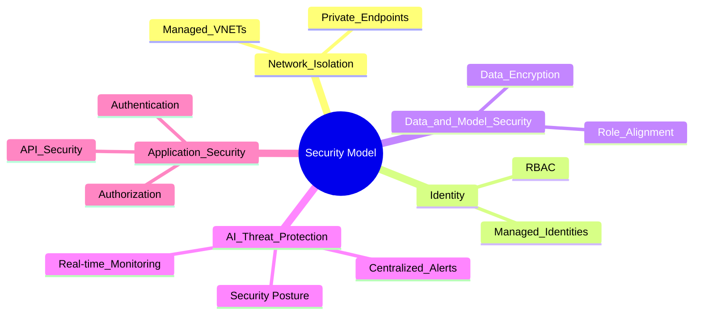
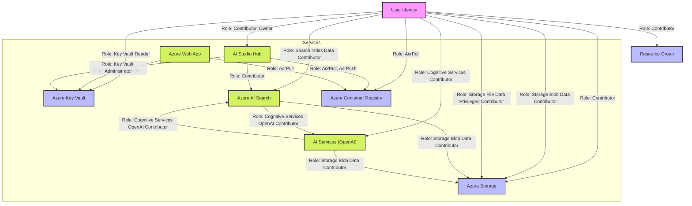
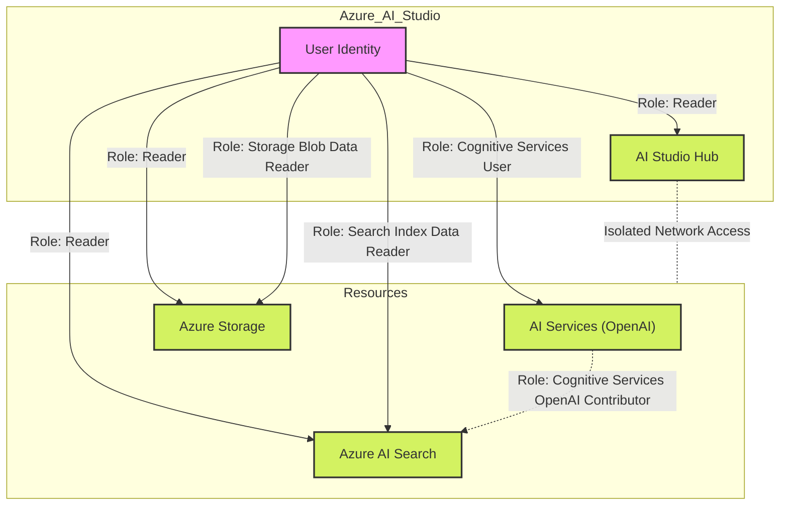
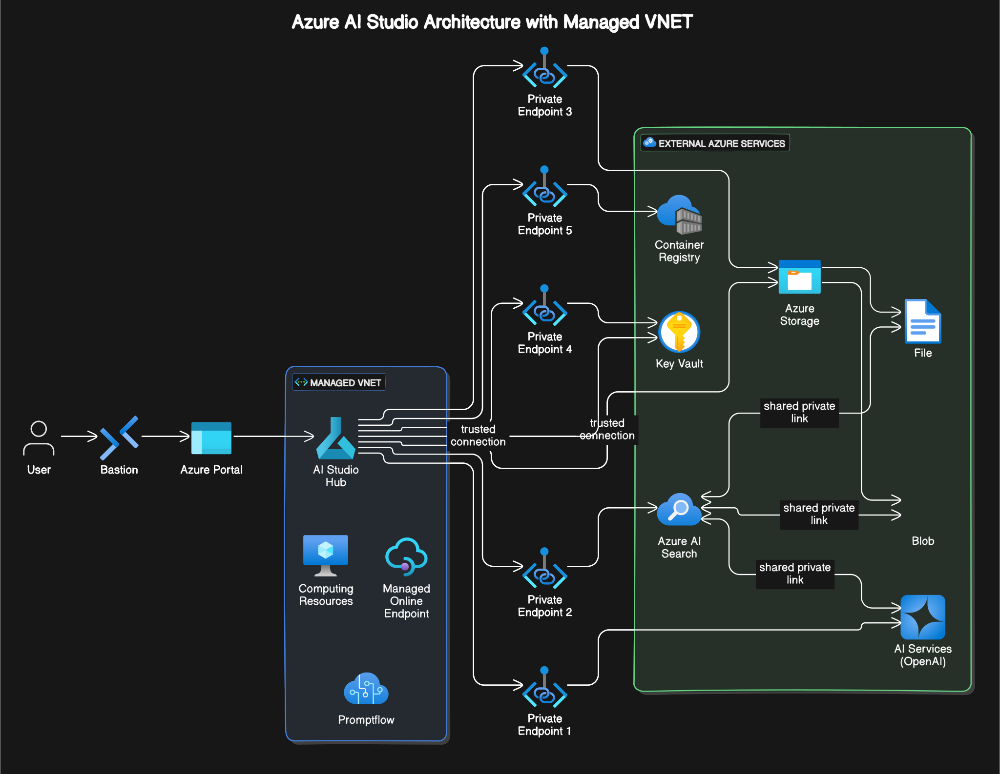

# Security Model in Azure AI Studio

## Overview

The security model of Azure AI Studio is robust and multi-faceted, designed to protect both the platform and the user environments. It integrates several key security components such as network isolation, Role-Based Access Control (RBAC), private links, and managed identities to provide a comprehensive security framework.

### Solution Architecture

In the Azure AI Studio environment, a robust network architecture is essential for ensuring secure and efficient operations. The architecture harnesses public and private endpoints, identity-based access, managed VNETs, and trusted services to create a secure and streamlined system.

In this article we will go into detail about the security controls implemented for this baseline architecture.

#### Public vs Private Endpoints

Initially, public endpoints may be used to provide convenience during deployment and user access. However, they pose potential security risks by exposing resources to the public internet, making them vulnerable to attacks. Conversely, private endpoints play a crucial role in security. They restrict access to authorized Virtual Networks (VNets), ensuring that only trusted networks can access specific resources. By establishing connections that remain invisible to the public, private endpoints significantly enhance the security posture of the environment.

#### Key-Based vs Identity-Based Access

Access control is a critical aspect of the security architecture. Traditionally, key-based access involves manual management of credentials, which can be cumbersome and prone to security leaks. Keys, if mishandled, can lead to unauthorized access.

Azure AI Studio leverages identity-based access to overcome these challenges. Managed Identities provide a more seamless and secure approach:

- **System-Assigned Identities** are automatically managed and tied directly to specific resources, eliminating the need for manual credential management.
- **User-Assigned Identities** offer greater flexibility and control, allowing a single identity to be utilized across multiple resources.

This method ensures secure access by reducing the risks associated with credential exposure.

#### Managed VNET and Trusted Services

The architecture includes a Managed VNET, which acts as a secure backbone facilitating communication across various components. This setup provides essential isolation and access control, utilizing network security groups and firewall rules to ensure that only authorized resources can communicate.

Trusted Services within Azure further enhance security by allowing secure interactions between services without restrictive network policies. This feature simplifies management, as trusted Azure services are pre-configured to communicate securely, maintaining both efficiency and security.

Together, these elements form a cohesive and secure architecture, allowing Azure AI Studio to operate effectively within a robust network framework, ensuring high security, operational efficiency, and seamless management of resources.

## Identity Layer

RBAC is critical in ensuring that users and services only have access to the resources necessary for their roles, minimizing potential security risks.

### Hub vs Project Roles

- **Hub**: 
  - Manages infrastructure such as VNets, keys, and policies.
  - Grants permissions for creating and configuring new hubs, centralizing control.

- **Project**:
  - Built on the settings of the hub, allowing developers to design and deploy AI solutions in a controlled environment.

### Default Roles at the Hub

| Role                       | Description                                                                 |
|----------------------------|----------------------------------------------------------------------------- |
| Owner                      | Full access, including hub creation and permissions management.              |
| Contributor                | Full access, excluding permission management.                                |
| Azure AI Developer         | Can create projects, deploy resources, but not manage hubs.                  |
| Azure AI Inference Deployment Operator | Deploys resources in resource groups.                              |
| Reader                     | Read-only access, default for all project members.                           |

### Default Roles for Projects

| Role                       | Description                                                                 |
|----------------------------|----------------------------------------------------------------------------- |
| Owner                      | Full project access, including assigning permissions.                       |
| Contributor                | Full project access, cannot assign permissions.                             |
| Azure AI Developer         | Can perform actions, including deployments, without assigning permissions. |
| Azure AI Inference Deployment Operator | Focused on resource deployments within projects.                    |
| Reader                     | View-only project access.                                                   |

### Dependency Service Permissions

Essential permissions required for hub creation across Azure resources:

| Permission                                | Purpose                                                         |
|-------------------------------------------|---------------------------------------------------------------- |
| `Microsoft.Storage/storageAccounts/write` | Create or configure storage accounts.                           |
| `Microsoft.KeyVault/vaults/write`         | Configure or create key vaults.                                 |
| `Microsoft.CognitiveServices/accounts/write` | Manage API accounts for services.                                |
| `Microsoft.MachineLearningServices/workspaces/write` | Setup or modify workspaces.                                     |

### RBAC for Deployment of AI Studio

For deploying AI Studio with an Entra ID managed identity strategy, a specific permission model must be followed to ensure secure and efficient interactions between services. This model leverages identity-based access to streamline authentication processes, enhancing security and simplifying management across Azure services.

- **User Identity**: Represents the user accessing Azure AI Studio. It requires roles like Contributor or Owner to create and manage resources effectively. This identity is crucial in specifying which users can perform deployment and operational activities within the Azure AI ecosystem.

- **AI Studio Hub**: Central to managing interactions between various Azure services, the AI Studio Hub facilitates access to container registries and Azure AI Search services. It ensures that applications can seamlessly connect to required resources, enabling efficient development and deployment workflows.

- **AI Storage, Key Vault, and Azure Container Registry**: These components have specific role assignments, such as Contributor and AcrPull, to facilitate smooth operations and secure data management. These roles ensure that appropriate permissions are in place for data storage, retrieval, and container image management.

- **OpenAI and AISearch**: These services require specific roles for accessing and managing data securely. Proper role assignments are essential to guarantee that data interactions remain secure and efficient.

- **Identity-Based vs. Key-Based Access**: Azure AI Studio can utilize identity-based access through Microsoft Entra ID, where a managed identity is used:
  - **Identity-Based Access**: If Entra ID authentication is in place, the user identity can seamlessly pass through services in Azure AI Studio, simplifying service connections and enhancing security.
  - **Key-Based Access**: Without identity-based methods, key-based access is used, requiring manual management of access keys, which can be less secure.

- **Service Permissions and Trusted Connectivity**: For the entire solution to function effectively, permissions need to be granted between interconnected services. This includes allowing specific roles and permissions for different components to interact, maintaining security and operational integrity:
  - **Trusted Service Connectivity**: Certain services can utilize Azure's trusted services to bypass traditional network restrictions. This connectivity ensures secure and efficient communication between services, leveraging Microsoft's backbone network.

Deploying the AI Studio environment requires careful consideration of these permission and access configurations to ensure a secure and efficient architecture. Each component plays a crucial role in the overall security posture and functionality of Azure AI Studio, enabling seamless development and deployment of AI solutions.

### Default Permissions for a Given User

After the initial deployment of the infrastructure, the following RBAC model is utilized to define the default permissions for a given user. This ensures secure and efficient access to Azure AI Studio resources while maintaining a structured permission framework.

- **User Identity**: Assigned Reader permissions to access various resources within Azure AI Studio. This role ensures that users can view resources without making modifications, maintaining security and integrity.

- **AI Storage, AIOpenAI, and AISearch**: Specific data reader roles are assigned to allow users to access and utilize insights and operational data. This ensures that users have the necessary access to perform their work effectively, while keeping data secure and access controlled.

This RBAC model allows for clear and controlled access, supporting efficient collaboration and resource management within the Azure AI Studio environment.

## Network Layer

    
Source Code of Diagram

title Azure AI Studio Architecture with Managed VNET

// Managed VNET group
Managed VNET [color: blue, icon: azure-virtual-network] {
  AI Studio Hub [icon: azure-machine-learning] // entry point
  Computing Resources [icon: azure-virtual-machines]
  Managed Online Endpoint [icon: azure-api-management-services]
  Promptflow [icon: azure-ai]
}

// External Azure Services group
External Azure Services [color: green, icon: azure-cloud-services] {
  AI Services (OpenAI) [icon: azure-openai]
  Azure AI Search [icon: azure-cognitive-search]
  Azure Storage [icon: azure-storage]
  Blob [icon: azure-blob]
  File [icon: azure-file]
  Key Vault [icon: azure-key-vault]
  Container Registry [icon: azure-container-registry]
}

// Azure Portal node
Azure Portal [icon: azure-portal]

// User Access
User [icon: user] > Bastion [icon: azure-bastion] > Azure Portal > AI Studio Hub

// Connections with private endpoint nodes
Private Endpoint 1 [icon: azure-private-link]
Private Endpoint 2 [icon: azure-private-link]
Private Endpoint 3 [icon: azure-private-link]
Private Endpoint 4 [icon: azure-private-link]
Private Endpoint 5 [icon: azure-private-link]

AI Studio Hub > Private Endpoint 1 > AI Services (OpenAI)
AI Studio Hub > Private Endpoint 2 > Azure AI Search
AI Studio Hub > Private Endpoint 3 > Azure Storage
AI Studio Hub > Private Endpoint 4 > Key Vault
AI Studio Hub > Private Endpoint 5 > Container Registry

// Azure Storage connections
Azure Storage > Blob
Azure Storage > File

// Trusted Connections
AI Studio Hub > Azure Storage [icon: azure-trusted-service]: trusted connection
AI Studio Hub > Key Vault [icon: azure-trusted-service]: trusted connection

// Shared private links
Azure AI Search <> AI Services (OpenAI) [icon: azure-private-link]: shared private link
Azure AI Search <> Blob [icon: azure-private-link]: shared private link
Azure AI Search <> File [icon: azure-private-link]: shared private link

 
In Azure AI Studio, the network architecture is designed to ensure secure and efficient interactions between resources. This is achieved through the strategic use of managed VNETs, private endpoints, trusted services, and private shared links.

### Managed VNET

- **Purpose**: Acts as the central backbone for isolating resources within Azure AI Studio. By creating isolated subnets, the managed VNET ensures that each component can communicate securely within defined boundaries.
- **Benefit**: Enhances security by segmenting different services, significantly reducing exposure to potential vulnerabilities. It enables controlled traffic flow and strict access management, ensuring that resources only communicate with authorized services.

### Private Endpoints

- **Purpose**: Establishes direct and secure connections between different resources within Azure AI Studio. By routing traffic through private endpoints, exposure to the public internet is minimized.
- **Benefit**: Maintains secure communications by allowing resources to interact without exposing their endpoints publicly. This prevents unauthorized access and reduces the risk of data breaches.

### Trusted Services

- **Purpose**: Facilitates secure and trusted interactions between Azure services. By leveraging Microsoft's backbone network, trusted services enable seamless communication between components.
- **Benefit**: Simplifies security management by utilizing built-in, trusted integration paths. This allows Azure services to communicate without requiring additional configurations, streamlining operations.

### Private Shared Links

- **Purpose**: Enables secure communication between Azure services such as AI Search and OpenAI. These private shared links ensure that data exchange occurs entirely within Microsoft's secure infrastructure.
- **Benefit**: Provides a secure and efficient pathway for inter-service communication, enhancing both performance and reliability. Data remains within trusted boundaries, minimizing external threats and ensuring data integrity.

## Data and Model Layer

### Data Protection Strategy

**Identity-Based Security:** 
- Access to data stored in indexes is tightly controlled through robust identity management. Only users with appropriate Role-Based Access Control (RBAC) roles can retrieve or manipulate data. This ensures that only authorized individuals have access to sensitive information.
- Data ingestion processes also adhere to these security protocols, ensuring a consistent application of best practices across all data interactions.

**Segregation and Role Alignment:**
- Data within AI Studio is segregated based on roles defined at both the hub and project levels. This segmentation ensures that users can only access data relevant to their roles, minimizing exposure and enhancing protection.
- Roles are clearly defined to enforce permissions and access levels across different environments, aligning with organizational security requirements.

### Model Deployment Security

**Role Alignment for Models:**
- Model deployments are aligned with the roles and permissions enforced by AI Studio, ensuring consistency and security throughout the deployment lifecycle.
- This alignment guarantees that access to model operations and configurations is restricted to those with the necessary credentials, further protecting intellectual property and preventing unauthorized modifications.

By implementing these identity-based measures, Azure AI Studio provides a secure and controlled environment for both data management and model deployment, ensuring adherence to organizational security policies and regulatory standards.

## AI Threat Protection Layer

Microsoft Defender for Cloud provides crucial security enhancements for AI workloads, including those leveraging Azure OpenAI services. By activating this, users can safeguard their AI applications against various threats, ensuring security and integrity.

### Scope of Protection

The AI Threat Protection Layer offers a wide scope of protection, tailored specifically for generative AI applications:

- **Real-time Monitoring:** Continuously watches over AI applications, including those using Azure OpenAI, to detect threats like data leakage, data poisoning, and credential theft. This proactive monitoring ensures vulnerabilities are caught early, preventing potential damage.

- **Centralized Alerts:** By integrating with Defender XDR, all security alerts are centralized, offering a coherent view of any potential attacks. This centralized approach simplifies the management and coordination of responses to threats across AI workloads.

- **User Prompt Evidence:** Alerts can be enhanced with suspicious segments from user prompts or model responses, facilitating efficient triage and classification of incidents. This feature aids in pinpointing the nature of threats quickly.

- **End-User Context:** Utilizing SecurityContext parameters in Azure OpenAI API calls, the system gains insights into end-user activities. This added context enhances the actionability of alerts, providing a more detailed understanding of potential security issues.

### Application in AI Studio

In the context of AI Studio, these protective measures ensure that AI models and data remain secure from unauthorized access and exploitation. Whether deploying machine learning models or generating content with OpenAI's sophisticated tools, the AI Threat Protection Layer acts as a guardian for sensitive operations.

> **Note:** These features are currently in preview. They represent cutting-edge capabilities that will evolve, providing opportunities for early adoption and feedback. Users should refer to Microsoft's Supplemental Terms of Use for Azure Previews for additional legal considerations.

By leveraging the AI Threat Protection Layer, organizations can enhance their security posture, ensuring their AI applications in AI Studio operate efficiently within a fortified environment.

## Application Layer: Securing Access to Prompt Flows

In Azure AI Studio, prompt flows are powerful tools for deploying AI models, and securing access to these through managed online endpoints is crucial. Here’s how you can enhance security at the application layer:

### Authentication and Authorization

The first step in protecting your application is ensuring that only the right people have access. This is achieved through robust authentication and granular authorization:

- **Robust Authentication:** By leveraging Azure Active Directory (Entra ID), you can manage identities effectively. This setup ensures that all users attempting to access your endpoints are properly authenticated, minimizing the risk of unauthorized infiltration.

- **Granular Authorization:** Implement Role-Based Access Control (RBAC) to clearly define what each user or application can access. Regularly reviewing and updating these permissions ensures that only those who need access can interact with sensitive components.

Vigilance is required to ensure data integrity:

- **Validate Inputs:** Carefully scrutinize inputs to prevent injection attacks. Implementing strong validation frameworks will help ensure that only well-formed data is processed, maintaining the integrity of your application’s operations.

- **Monitor and Log Activity:** Keeping an eye on what’s happening is vital. By enabling logging, you can trace who accessed what and when. Use monitoring tools to quickly spot any unusual activity, allowing for rapid responses to potential threats.

### API Security

APIs are gateways into your system, requiring stringent security measures:

- **Controlled Access:** Implement rate limits to prevent your APIs from being overwhelmed. An API gateway can manage access and provide an extra layer of security, ensuring your system remains resilient against excessive demand.

- **Data Privacy:** Ensure your APIs only expose what is absolutely necessary

## Conclusion: Security Model in Azure AI Studio

The security model in Azure AI Studio is comprehensive, focusing on protecting user environments and the platform itself through a combination of network isolation, Role-Based Access Control (RBAC), private links, managed identities, and other key components. 

### Key Highlights

- **Robust Architecture**: Utilizes public and private endpoints, managing Virtual Networks (VNETs), and trusted services to ensure secure operations.

- **Identity Layer**: RBAC is integral, assigning specific roles at both the hub and project levels to control access effectively.

- **Network Layer**: Implements managed VNETs, private endpoints, and trusted services for robust network security.

- **Data and Model Layer**: Focuses on identity-based security and role alignment to protect sensitive data and models.

- **AI Threat Protection**: Employs Microsoft Defender for Cloud to safeguard AI workloads through real-time monitoring and centralized alerts.

- **Application Layer Security**: Enhances security at the application level through authentication, authorization, and API security measures.

By combining these elements, Azure AI Studio provides a secure, efficient, and controlled environment for developing and deploying AI solutions, aligning with best practices and regulatory standards.
